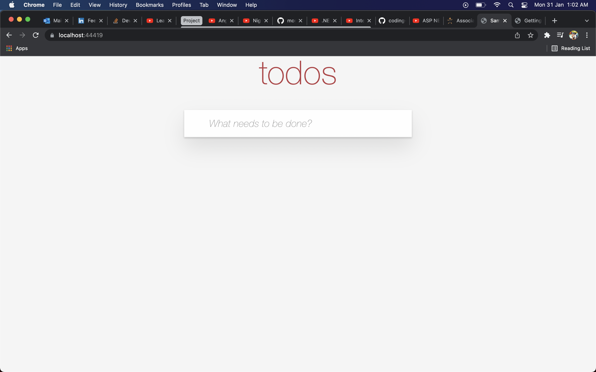
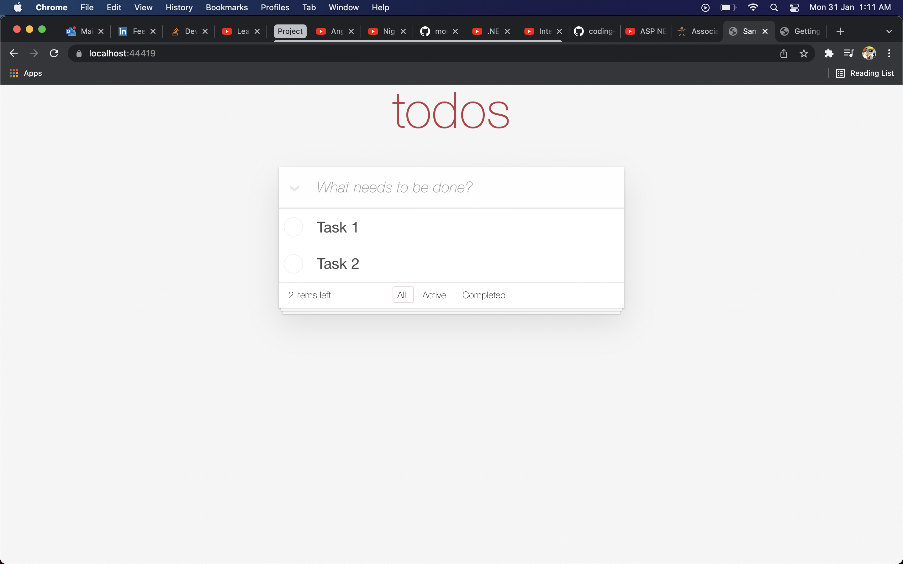

# SampleDemo
.Net Core Angular app with azure key vault for end to end encryption

We are trying to build a Todo tasks app with .Net core web api backend, Angular front end and react database.

# Sample screenshots of the app

# Task List
- [x] Create .net core app with angular frontend using the command `dotnet new angular -n SampleDemo`
- [x] Build a ToDo App API with in-mem data.
- [x] Build a todo angular app using the newly created api.
- [ ] Change the in mem api repository to point to mongo db repository.
- [ ] Connect the angular app to the api calls.
- [ ] Setup CI in Github actions to run build and test whenever the code is modified.